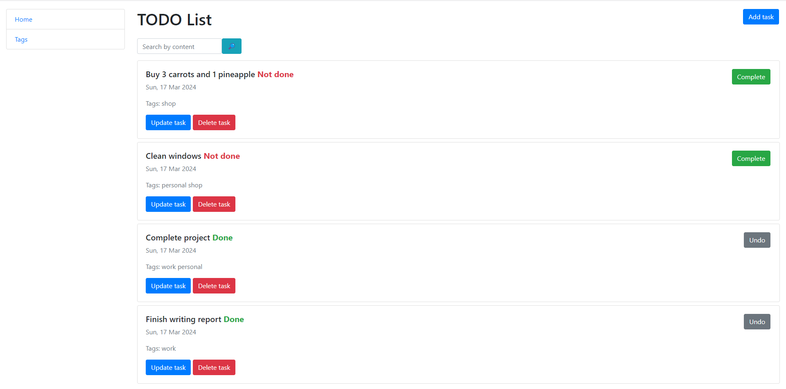

# To-Do List App

> The To-Do List is a simple Django web application that allows users to create, manage, and organize their to-do tasks.
> Built using the Django framework and adhering to the Model-View-Template (MVT) architectural pattern.


## Installing / Getting started

Python3 must be already installed.

```shell
git clone https://github.com/MilArtem78/todo_list.git
cd todo_list/
python3 -m venv venv
source venv/bin/activate
pip install -r requirements.txt
python manage.py runserver
```

## Demo


